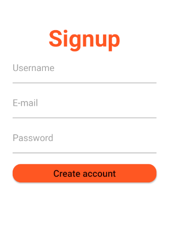
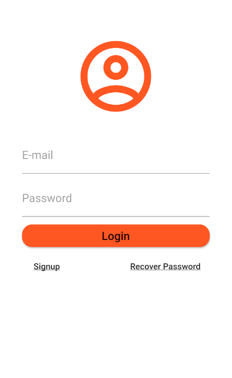

# openCX-t7g1-last4 Development Report

Welcome to the documentation pages of the *EasyShare* of **openCX**!

You can find here detailed about the (sub)product, hereby mentioned as module, from a high-level vision to low-level implementation decisions, a kind of Software Development Report (see [template](https://github.com/softeng-feup/open-cx/blob/master/docs/templates/Development-Report.md)), organized by discipline (as of RUP): 

* Business modeling 
  * [Product Vision](#Product-Vision)
  * [Elevator Pitch](#Elevator-Pitch)
* Requirements
  * [Use Case Diagram](#Use-case-diagram)
  * [User stories](#User-stories)
  * [Domain model](#Domain-model)
* Architecture and Design
  * [Logical architecture](#Logical-architecture)
  * [Physical architecture](#Physical-architecture)
  * [Prototype](#Prototype)
* [Implementation](#Implementation)
* [Test](#Test)
* [Configuration and change management](#Configuration-and-change-management)
* [Project management](#Project-management)

So far, contributions are exclusively made by the initial team, but we hope to open them to the community, in all areas and topics: requirements, technologies, development, experimentation, testing, etc.

Please contact us! 

Thank you!

*Guilherme Callasi*
*Joana Ferreira*
*José Macedo*
*Marcelo Reis*

---

## Product Vision

EasyShare is an app created to manage an event's social networks and make sure they are all in synchronized.

---
## Elevator Pitch
Draft a small text to help you quickly introduce and describe your product in a short time and a few words (~800 characters), a technique usually known as elevator pitch.

Take a look at the following links to learn some techniques:
* [Crafting an Elevator Pitch](https://www.mindtools.com/pages/article/elevator-pitch.htm)
* [The Best Elevator Pitch Examples, Templates, and Tactics - A Guide to Writing an Unforgettable Elevator Speech, by strategypeak.com](https://strategypeak.com/elevator-pitch-examples/)
* [Top 7 Killer Elevator Pitch Examples, by toggl.com](https://blog.toggl.com/elevator-pitch-examples/)

---
## Requirements

In this section, you should describe all kinds of requirements for your module: functional and non-functional requirements.

Start by contextualizing your module, describing the main concepts, terms, roles, scope and boundaries of the application domain addressed by the project.

### Use case diagram 

#### Register:
- Actor: Conference Owner

- Description: To use the app and her functionalities, like saving all your events, creating new ones and share with the target audience, you must register before.

- Preconditions and Postconditions: The user should not have any account (with the same email) saved in the application. After register, the user will have access to all app functionalities.

- Normal Flow:
1. User thinks about the pretended username and password.
2. User insert the fields in their position and submit.
3. The system verifies if the email, password and username are valid.
4. The system saves the data from the user.

- Alternative Flows and Exceptions: If the verification process fails (3 point) the system will warn the user and request to input all the fields again or the fields that are invalid.   

#### Login:
- Actor: Conference Owner

- Description: To access the app functionalities, presuming that you are already register and the account was logged out, you will need to log in with your email and password.

- Preconditions and Postconditions: The user should have already an EasyShare account. After logging in, the user will have access to his account and app functionalities.

- Normal Flow:
1. User insert the fields in their position and submit.
2. The system verifies if the email and password are valid.
3. The system grants user access. 

- Alternative Flows and Exceptions: If the verification process fails the system will warn the user and request to input both fields again.

#### Logout:
- Actor: Conference Owner

- Description: In order to protect all the information within the account and be able to switch to another account at any time it’s important to have the logout functionality. 

- Preconditions and Postconditions: The user must be logged in before trying to log out. After logging out, the user can now log in with other account or close the app knowing that their information is secure.

- Normal Flow:
1. User clicks the logout button.
2. The system will redirect to welcome page.

- Alternative Flows and Exceptions: In principle logout will never fail.

#### Create an event:
- Actor: Conference Owner

- Description: For more event handling, we offer the functionality to create an event that will be saved for future use.

- Preconditions and Postconditions: The user must be logged to create an event in the app. After creating an event, this will be available in his personal events for future updates.

- Normal Flow:
1. User logs in with their credentials.
2. The system grants user access.
3. User creates an event.
4. The system will verify if all fields are acceptable.
5. The system will add the created event to the list of personal events. 

- Alternative Flows and Exceptions: If the verification step fails the system will warn the user and notify what fields are incorrect.

#### Update an event:
- Actor: Conference Owner

- Description: In order to manage personal events with possible errors or with fields under discussion, we offer update functionality to be able to change events when necessary.

- Preconditions and Postconditions: The user should have at least one event to use update functionality. After updating an event, it will be visible in personal events with the changes made. 

- Normal Flow:
1. User chooses which event to change.
2. The system will redirect to other window where the user can make changes to events.
3. User changes the pretended fields and submit.
4. The system will verify if the fields submitted are correct.
5. The system makes changes to the event.

- Alternative Flows and Exceptions: If the verification step fails the system will warn the user and notify what fields are incorrect.

#### Delete an event:
- Actor: Conference Owner

- Description: In cases where the user creates a wrong event or wants to remove events from his personal list, he can delete those events through the delete functionality.

- Preconditions and Postconditions: The user should have at least one event to use delete functionality. After deleting an event, it will be removed from his personal events.

- Normal Flow:
1. User chooses which event to delete.
2. The system will delete the event from the user account.

- Alternative Flows and Exceptions: In principle the delete will never fail.

#### See all personal Events:
- Actor: Conference Owner

- Description: If the user wants to see the status of personal events and their information, he can do it using this functionality.   

- Preconditions and Postconditions: The user should have at least one event to use this functionality.

- Normal Flow:
1. User clicks in “See all persona Events”.
2. The system will print all the information about all events. 

- Alternative Flows and Exceptions:  In principle the print of all events will never fail.

#### Sync. Events with social networks:
- Actor: Conference Owner

- Description: In order to facilitate the user’s work, the application will propagate the events   through the social networks that the user wants. This can be either automatic or manual.

- Preconditions and Postconditions: The user must associate his social networks with EasyShare to start sharing his events. After sharing, the events must appear in user social networks.

- Normal Flow:
1. User set automatic sync.
2. The system changes the way that propagate the events to automatic.
3. User creates an event.
4. The system will automatically share it on user social networks.

- Alternative Flows and Exceptions: There are more ways to do it like when sync. is in manual mode the user can go to update event and upload it to social networks. If the user doesn’t have any social network associated this functionality will be off. 

### User stories
This section will contain the requirements of the product described as **user stories**, organized in a global **[user story map](https://plan.io/blog/user-story-mapping/)** with **user roles** or **themes**.

*As a < user role >, I want < goal > so that < reason >.*

1. As a conference owner, I want to register so that I have an account on the EasyShare app.
  - **User interface mockups**.
  
  - **Acceptance tests**.
    - Scenario: I try to register corectly
      - When I try to register with the correct email and password
      - Then then system will grant create my EasyShare account
    - Scenario: I try to register incorrectly
      - When I try to register with a not valid email
      - Then the system will notify me with an error message
    - Scenario: I leave the register field empty
      - When I leave the fields empty and try to register
      - Then the system will notify me with an error message
  - **Value and effort**.
    - Value: should have, but does not bring any value to customer.
    - Effort to implement: S
  
2. As a conference owner, I want to login so that I can access my personal account.
  - **User interface mockups**. 
  
  - **Acceptance tests**.
    - Scenario: I try to login corectly
      - When I try to login with the correct email and password
      - Then then system will grant access to my account
    - Scenario: I try to login incorrectly
      - When I try to login with the wrong email or password
      - Then the system will notify me with an error message
    - Scenario: I leave the login field empty
      - When I leave the fields empty and try to login
      - Then the system will notify me with an error message
  - **Value and effort**.
    - Value: should have, but does not bring any value to customer.
    - Effort to implement: S
3. As a conference owner, I want to logout so that I close my personal account.
  - **User interface mockups**.
  - **Acceptance tests**.
    - Scenario: I turn off the app
        - Given I turn off the app 
        - When I don't logout my account 
        - Then when reopened, the account will be logged
    - Scenario: I logout 
        - When I logout my account 
        - Then the system will close the connection with the customer account and redirect to welcome page
  - **Value and effort**.
    - Value: should have, but does not bring any value to customer.
    - Effort to implement: XS

4. As a conference owner, I want to create an event so that I can manage it on the app.
  - **User interface mockups**.
  - **Acceptance tests**.
      - Scenario: I create an event successfuly
        - When I create an event, the button will say I have created an event.
  - **Value and effort**.
  
5. As a conference owner, I want to change an event so that I can update data.
  - **User interface mockups**.
  - **Acceptance tests**.
  - **Value and effort**.

6. As a conference owner, I want to see a list of my events so that is easier to access them.
  - **User interface mockups**.
  - **Acceptance tests**.
  - **Value and effort**.
  
7. As a conference owner, I can associate EasyShare account with mysocial media accounts so that I can communicate between them.
  - **User interface mockups**.
  - **Acceptance tests**.
  - **Value and effort**.

8. As a conference owner, I can automatically add an event on the desired social networks so that it will be syncronize.
  - **User interface mockups**.
  - **Acceptance tests**.
  - **Value and effort**.

9. As a conference owner, I can automatically update an event on the desired social networks so that data will be syncronize.
  - **User interface mockups**.
  - **Acceptance tests**.
  - **Value and effort**.

**INVEST in good user stories**. 
You may add more details after, but the shorter and complete, the better. In order to decide if the user story is good, please follow the [INVEST guidelines](https://xp123.com/articles/invest-in-good-stories-and-smart-tasks/).

**User interface mockups**.
After the user story text, you should add a draft of the corresponding user interfaces, a simple mockup or draft, if applicable.

**Acceptance tests**.
For each user story you should write also the acceptance tests (textually in Gherkin), i.e., a description of scenarios (situations) that will help to confirm that the system satisfies the requirements addressed by the user story.

**Value and effort**.
At the end, it is good to add a rough indication of the value of the user story to the customers (e.g. [MoSCoW](https://en.wikipedia.org/wiki/MoSCoW_method) method) and the team should add an estimation of the effort to implement it, for example, using t-shirt sizes (XS, S, M, L, XL).

### Domain model

To better understand the context of the software system, it is very useful to have a simple UML class diagram with all the key concepts (names, attributes) and relationships involved of the problem domain addressed by your module.

---

## Architecture and Design
The architecture of a software system encompasses the set of key decisions about its overall organization. 

A well written architecture document is brief but reduces the amount of time it takes new programmers to a project to understand the code to feel able to make modifications and enhancements.

To document the architecture requires describing the decomposition of the system in their parts (high-level components) and the key behaviors and collaborations between them. 

In this section you should start by briefly describing the overall components of the project and their interrelations. You should also describe how you solved typical problems you may have encountered, pointing to well-known architectural and design patterns, if applicable.

### Logical architecture
The purpose of this subsection is to document the high-level logical structure of the code, using a UML diagram with logical packages, without the worry of allocating to components, processes or machines.

It can be beneficial to present the system both in a horizontal or vertical decomposition:
* horizontal decomposition may define layers and implementation concepts, such as the user interface, business logic and concepts; 
* vertical decomposition can define a hierarchy of subsystems that cover all layers of implementation.

### Physical architecture
The goal of this subsection is to document the high-level physical structure of the software system (machines, connections, software components installed, and their dependencies) using UML deployment diagrams or component diagrams (separate or integrated), showing the physical structure of the system.

It should describe also the technologies considered and justify the selections made. Examples of technologies relevant for openCX are, for example, frameworks for mobile applications (Flutter vs ReactNative vs ...), languages to program with microbit, and communication with things (beacons, sensors, etc.).

### Prototype
To help on validating all the architectural, design and technological decisions made, we usually implement a vertical prototype, a thin vertical slice of the system.

In this subsection please describe in more detail which, and how, user(s) story(ies) were implemented.

---

## Implementation
Regular product increments are a good practice of product management. 

While not necessary, sometimes it might be useful to explain a few aspects of the code that have the greatest potential to confuse software engineers about how it works. Since the code should speak by itself, try to keep this section as short and simple as possible.

Use cross-links to the code repository and only embed real fragments of code when strictly needed, since they tend to become outdated very soon.

---
## Test

There are several ways of documenting testing activities, and quality assurance in general, being the most common: a strategy, a plan, test case specifications, and test checklists.

In this section it is only expected to include the following:
* test plan describing the list of features to be tested and the testing methods and tools;
* test case specifications to verify the functionalities, using unit tests and acceptance tests.
 
A good practice is to simplify this, avoiding repetitions, and automating the testing actions as much as possible.

---
## Configuration and change management

Configuration and change management are key activities to control change to, and maintain the integrity of, a project’s artifacts (code, models, documents).

For the purpose of ESOF, we will use a very simple approach, just to manage feature requests, bug fixes, and improvements, using GitHub issues and following the [GitHub flow](https://guides.github.com/introduction/flow/).

---

## Project management

Software project management is an art and science of planning and leading software projects, in which software projects are planned, implemented, monitored and controlled.

In the context of ESOF, we expect that each team adopts a project management tool capable of registering tasks, assign tasks to people, add estimations to tasks, monitor tasks progress, and therefore being able to track their projects.

Example of tools to do this are:
  * [Trello.com](https://trello.com)
  * [Github Projects](https://github.com/features/project-management/com)
  * [Pivotal Tracker](https://www.pivotaltracker.com)
  * [Jira](https://www.atlassian.com/software/jira)

We recommend to use the simplest tool that can possibly work for the team.

---

## Evolution - contributions to open-cx

Describe your contribution to open-cx (iteration 5), linking to the appropriate pull requests, issues, documentation.
