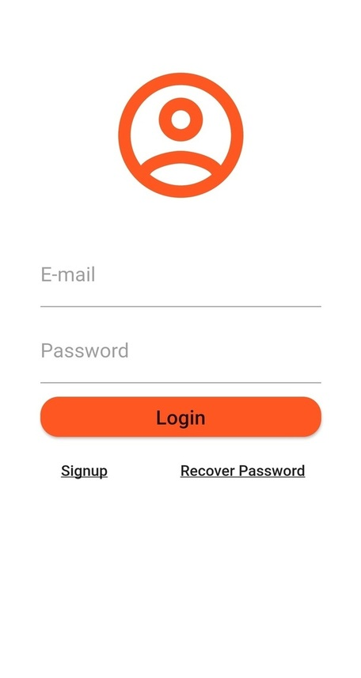
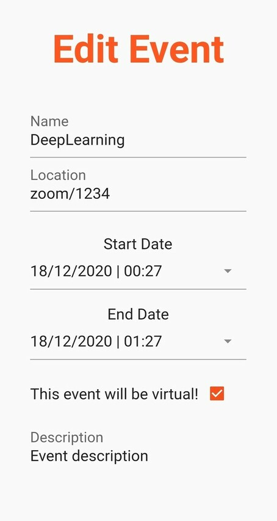
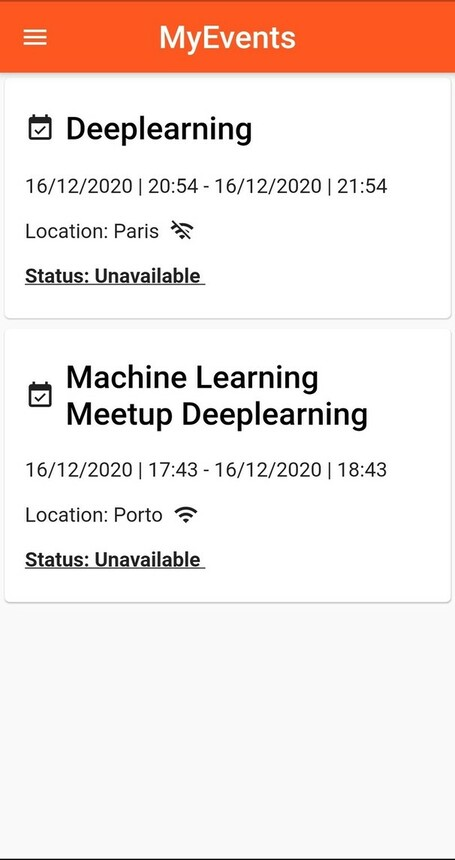
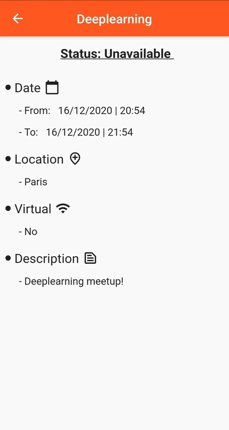
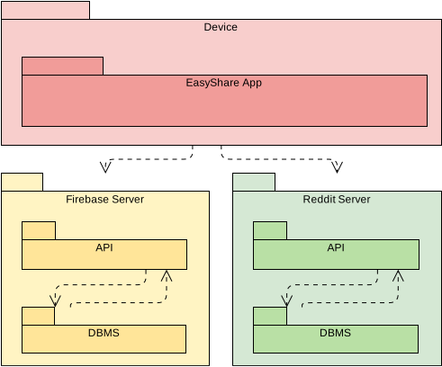

# openCX-t7g1-last4 Development Report

Welcome to the documentation pages of the *EasyShare* of **openCX**!

You can find here detailed about the (sub)product, hereby mentioned as module, from a high-level vision to low-level implementation decisions, a kind of Software Development Report (see [template](https://github.com/softeng-feup/open-cx/blob/master/docs/templates/Development-Report.md)), organized by discipline (as of RUP): 

* Business modeling 
  * [Product Vision](#Product-Vision)
  * [Elevator Pitch](#Elevator-Pitch)
* Requirements
  * [Use Case Diagram](#Use-case-diagram)
  * [User stories](#User-stories)
  * [Domain model](#Domain-model)
* Architecture and Design
  * [Logical architecture](#Logical-architecture)
  * [Physical architecture](#Physical-architecture)
  * [Prototype](#Prototype)
* [Implementation](#Implementation)
* [Test](#Test)
* [Configuration and change management](#Configuration-and-change-management)
* [Project management](#Project-management)

So far, contributions are exclusively made by the initial team, but we hope to open them to the community, in all areas and topics: requirements, technologies, development, experimentation, testing, etc.

Please contact us! 

Thank you!

*Guilherme Callasi,*
*Joana Ferreira,*
*José Macedo,*
*Marcelo Reis*

---

## Product Vision

EasyShare is an app created to manage an event's social networks and make sure they are all in synchronized. <br>
The app allows the user to manage his events and don't worry about posting updates on social networks.

---
## Elevator Pitch
Have you ever updated an event and forgotten to replicate on all your social networks?<br>
Our name is EasyShare, an app that is made for event owners that allows them to save time and keep tracking the event on social media.<br>
Unlike other applications for managing events, our main goal is to get together in one place tools where the user can control the status of his events on different social networks.<br>
Now is **Easy to Share**, download and start saving time.<br>

---
## Requirements
In this section, you should describe all kinds of requirements for your module: functional and non-functional requirements.

Start by contextualizing your module, describing the main concepts, terms, roles, scope and boundaries of the application domain addressed by the project.

### Use case diagram 


#### Register:
- Actor: Conference Owner

- Description: To use the app and her functionalities, like saving all your events, creating new ones and share with the target audience, you must register before.

- Preconditions and Postconditions: The user should not have any account (with the same email) saved in the application. After register, the user will have access to all app functionalities.

- Normal Flow:
1. User thinks about the pretended username and password.
2. User insert the fields in their position and submit.
3. The system verifies if the email, password and username are valid.
4. The system saves the data from the user.

- Alternative Flows and Exceptions: If the verification process fails (3rd point) the system will warn the user and request to input the fields that are invalid.   

#### Login:
- Actor: Conference Owner

- Description: To access the app functionalities, presuming that you are already register and the account was logged out, you will need to log in with your email and password.

- Preconditions and Postconditions: The user should have already an EasyShare account. After logging in, the user will have access to his account and app functionalities.

- Normal Flow:
1. User insert the fields in their position and submit.
2. The system verifies if the email and password are valid.
3. The system grants user access. 

- Alternative Flows and Exceptions: If the verification process fails the system will warn the user and request to input the fields that are invalid.

#### Logout:
- Actor: Conference Owner

- Description: In order to protect all the information within the account and be able to switch to another account at any time it’s important to have the logout functionality. 

- Preconditions and Postconditions: The user must be logged in before trying to log out. After logging out, the user can now log in with other account or close the app knowing that their information is secure.

- Normal Flow:
1. User clicks in the logout button.
2. The system will redirect to welcome page.

- Alternative Flows and Exceptions: In principle logout will never fail.

#### Create an event:
- Actor: Conference Owner

- Description: For more event handling, we offer the functionality to create an event that will be saved for future use.

- Preconditions and Postconditions: The user must be logged to create an event in the app. After creating an event, this will be available in his personal events for future updates.

- Normal Flow:
1. User logs in with their credentials.
2. The system grants user access.
3. User clicks in the floating button '+'
4. User creates an event.
5. The system will verify if all fields are acceptable.
6. The system will add the created event to the list of personal events. 

- Alternative Flows and Exceptions: If the verification step fails the system will warn the user and notify what fields are incorrect.

#### Update an event:
- Actor: Conference Owner

- Description: In order to manage personal events with possible errors or with fields under discussion, we offer update functionality to be able to change events when necessary.

- Preconditions and Postconditions: The user should have at least one event to use update functionality. After updating an event, it will be visible in personal events with the changes made. 

- Normal Flow:
1. User chooses which event to change.
2. The system will redirect to other window where the user can make changes to events.
3. User changes the pretended fields and submit.
4. The system will verify if the fields submitted are correct.
5. The system makes changes to the event.

- Alternative Flows and Exceptions: If the verification step fails the system will warn the user and notify what fields are incorrect.

#### Delete an event:
- Actor: Conference Owner

- Description: In cases where the user creates a wrong event or wants to remove events from his personal list, he can delete those events through the delete functionality.

- Preconditions and Postconditions: The user should have at least one event to use delete functionality. After deleting an event, it will be removed from his personal events.

- Normal Flow:
1. User chooses which event to delete.
2. The system will delete the event from the user account.

- Alternative Flows and Exceptions: In principle the delete will never fail.

#### See all personal Events:
- Actor: Conference Owner

- Description: If the user wants to see the status of personal events and their information, he can do it using this functionality.   

- Preconditions and Postconditions: The user should have at least one event to use this functionality.

- Normal Flow:
1. User clicks in “MyEvents”.
2. The system will print all the information about all events. 

- Alternative Flows and Exceptions:  In principle the print of all events will never fail.

#### Sync. Events with social networks:
- Actor: Conference Owner

- Description: In order to facilitate the user’s work, the application will propagate the events through the social networks that the user wants. This can only be manual.

- Preconditions and Postconditions: The user must associate his social networks with EasyShare to start sharing his events. After sharing, the events must appear in user social networks.

- Normal Flow:
1. User select the event that want to share.
2. User clicks in the button that share the event to social networks.
3. The system will share the event.

- Alternative Flows and Exceptions: If the user doesn’t have any social network associated this functionality will be off. 

### User stories
#### User stories map
  

**1. As a conference owner, I want to register so that I have an account on the EasyShare app.**
  - **User interface mockups**.<br>
    
  - **Acceptance tests**.
```gherkin
Scenario: I try to register corectly
  Given I enter in to the register page  
  When I try to register with the correct email and password
  Then then system will grant create my EasyShare account
```
```gherkin
Scenario: I try to register incorrectly
  Given I enter in to the register page 
  When I try to register with a not valid email
  Then the system will notify me with an error message
```
```gherkin
Scenario: I leave the register field empty
  Given I enter in to the register page 
  When I leave the fields empty and try to register
  Then the system will notify me with an error message
```
  - **Value and effort**.
    - Value: should have, but does not bring any value to customer.
    - Effort to implement: S 
    
**2. As a conference owner, I want to login so that I can access my personal account.**
  - **User interface mockups**.<br>
    
  - **Acceptance tests**.
```gherkin
Scenario: When I try to login corectly, the app should grant access to my personal account
  Given I enter in to the login page  
  When I try to login with the correct email and password
  Then I will have access to my account
```
```gherkin
Scenario: When I try to login incorrectly, the app should notify me with an error message
  Given I enter in to the login page
  When I try to login with the wrong email or password
  Then I will be notify with an error message
```
```gherkin
Scenario: When I leave the login field empty, the app should notify me whith an error message
  Given I enter in to the login page
  When I leave the fields empty and try to login
  Then I will be notify with an error message
```
  - **Value and effort**.
    - Value: should have, but does not bring any value to customer.
    - Effort to implement: S 
    
**3. As a conference owner, I want to logout so that I close my personal account.**
  - **User interface mockups**.
    
  - **Acceptance tests**.
```gherkin
Scenario: If I turn off the app, when reopened, the account will be logged
   Given I turn off the app 
   When I don't logout my account 
   Then when reopened, my account will still be logged
```
```gherkin
Scenario: When I logout, the app will disconnect my account 
   Given I want to close my app safely
   When I logout my account 
   Then the app will disconnect my account and I will be redirect to welcome page
```
  - **Value and effort**.
    - Value: should have, but does not bring any value to customer.
    - Effort to implement: XS 
    
**4. As a conference owner, I want to create an event so that I can manage it on the app.**
  - **User interface mockups**.
    
  - **Acceptance tests**.
```gherkin
Scenario: I create an event successfuly
  Given I create an event successfuly
  When I create an event, the button will say I have created an event.
  Then the event is created and added to the database.
```
  - **Value and effort**.
    - Value: Must have.
    - Effort to implement: M 
  
**5. As a conference owner, I want to change an event so that I can update data.**
  - **User interface mockups**.
    
  - **Acceptance tests**.
```gherkin
Scenario: If I try to edit an event incorrectly the app should warn me with an error message
   Given I enter in to edit page and try to edit the event with incorrect data
   When I click in the button that saves all the changes made
   Then I will be notify with a clear error message
```
```gherkin
Scenario: When I select the start date or the end date incorrectly, the app should warn me with an erro message
   Given I select a start date for the event
   When I select an end date that is before than start date
   Then I will be notify with an error message
```
```gherkin
Scenario: If I click in "Cancel Edit" button the previous changes made should not be saved
   Given I unintentionally change an event field 
   When I click in "Cancel Edit" button 
   Then the previous changes made will not be saved
```
```gherkin
Scenario: When I edit an event and save the changes made, the app should update all the informations changed
   Given I enter in to edit page and change the event information
   When I click in "Save Edit" button 
   Then the app will save the changes made an I will be redirect to home page 
```
  - **Value and effort**.
    - Value: Must have.
    - Effort to implement: M

**6. As a conference owner, I want to delete an event so that It doesn't appear on the app.**
  - **User interface mockups**.
    
  - **Acceptance tests**.
```gherkin
Scenario: When I delete an event, it should not appear on my event page and on my home page
  Given I click in the icon that delete the event
  When I click in 'yes' option 
  Then the event is deelted and removed from the database.
```
  - **Value and effort**.
    - Value: Must have.
    - Effort to implement: M 
   
**7. As a conference owner, I want to see a list of my events so that is easier to access them.**
  - **User interface mockups**.
    
  - **Acceptance tests**.
```gherkin
Scenario: When I enter in to MyEventes page, the app should diplay all my events chronologically ordered
   Given I want to see my events
   When I enter in to MyEvents Page
   Then I will see all my events chronologically ordered
```
```gherkin
Scenario: When I enter in to home page, the app should diplay my events that still available chronologically ordered 
   Given I want to see the upcoming events
   When I enter in to Home Page
   Then I will see my events that still available chronologically ordered 
```
  - **Value and effort**.
    - Value: Must have.
    - Effort to implement: M
    
**8. As a conference owner, I want to select a specific event and see its details.**
  - **User interface mockups**.
    
  - **Acceptance tests**.
```gherkin
Scenario: When I click in the name of one event, the app should display all the details from the selected event
   Given I want to see the details of the event
   When I click in the name of the desired event
   Then I will see all the details from the selected event
```
  - **Value and effort**.
    - Value: Must have.
    - Effort to implement: S
    
**9. As a conference owner, I can associate EasyShare account with reddit so that I can communicate between them.**
  - **User interface mockups**.
  - **Acceptance tests**.
  - **Value and effort**.

**10. As a conference owner, I can automatically add an event on reddit so that it will be syncronize.**
  - **User interface mockups**.
  - **Acceptance tests**.
  - **Value and effort**.

**11. As a conference owner, I can automatically update an event on reddit so that data will be syncronize.**
  - **User interface mockups**.
  - **Acceptance tests**.
  - **Value and effort**.
  
**12. As a conference owner,  I can automatically delete an event on reddit so that data will be syncronize.**
  - **User interface mockups**.
  - **Acceptance tests**.
  - **Value and effort**.
    - Value: Must have.
    - Effort to implement: M 

### Domain model
To better understand the context of the software system, it is very useful to have a simple UML class diagram with all the key concepts (names, attributes) and relationships involved of the problem domain addressed by your module.


---

## Architecture and Design
The architecture of a software system encompasses the set of key decisions about its overall organization. 

A well written architecture document is brief but reduces the amount of time it takes new programmers to a project to understand the code to feel able to make modifications and enhancements.

To document the architecture requires describing the decomposition of the system in their parts (high-level components) and the key behaviors and collaborations between them. 

In this section you should start by briefly describing the overall components of the project and their interrelations. You should also describe how you solved typical problems you may have encountered, pointing to well-known architectural and design patterns, if applicable.

### Logical architecture
The purpose of this subsection is to document the high-level logical structure of the code, using a UML diagram with logical packages.


EasyShare high-level logical structure follows the Layered Architecture Pattern.

### Physical architecture
The goal of this subsection is to document the high-level physical structure of the software system, showing the physical structure of the system.



The main technologie considered was Flutter for the mobile UI combined with Firebase to store all the data.

### Prototype
To help on validating all the architectural, design and technological decisions made, we usually implement a vertical prototype, a thin vertical slice of the system.

In this subsection please describe in more detail which, and how, user(s) story(ies) were implemented.

---

## Implementation
Regular product increments are a good practice of product management. 

While not necessary, sometimes it might be useful to explain a few aspects of the code that have the greatest potential to confuse software engineers about how it works. Since the code should speak by itself, try to keep this section as short and simple as possible.

Use cross-links to the code repository and only embed real fragments of code when strictly needed, since they tend to become outdated very soon.

---
## Test

Unit Tests:<br>
In the Unit Tests we focused our tests on the features related to the insertion of a Profile (email and password) and on Events(title and location).<br>

---
## Configuration and change management

Configuration and change management are key activities to control change to, and maintain the integrity of, a project’s artifacts (code, models, documents).

For the purpose of ESOF, we will use a very simple approach, just to manage feature requests, bug fixes, and improvements, using GitHub issues and following the [GitHub flow](https://guides.github.com/introduction/flow/).


---

## Project management

Software project management is an art and science of planning and leading software projects, in which software projects are planned, implemented, monitored and controlled.

In the context of ESOF, we expect that each team adopts a project management tool capable of registering tasks, assign tasks to people, add estimations to tasks, monitor tasks progress, and therefore being able to track their projects.

Example of tools to do this are:
  * [Trello.com](https://trello.com)
  * [Github Projects](https://github.com/features/project-management/com)
  * [Pivotal Tracker](https://www.pivotaltracker.com)
  * [Jira](https://www.atlassian.com/software/jira)

We recommend to use the simplest tool that can possibly work for the team.


---

## Evolution - contributions to open-cx

Describe your contribution to open-cx (iteration 5), linking to the appropriate pull requests, issues, documentation.
